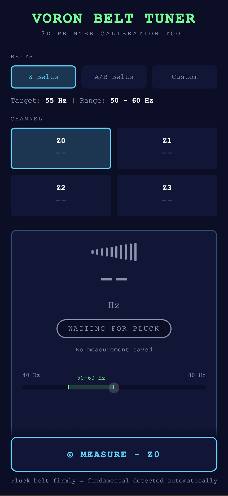

# 🎸 Voron Belt Tuner

A lightweight, browser-based web application to measure and tune the belt tension of your Voron 3D printer. It uses your device's microphone and the Web Audio API to detect the fundamental frequency of the plucked belt, functioning exactly like a digital guitar tuner.

Hosted entirely on **GitHub Pages**, it requires no backend, no installation, and works directly on your mobile phone's browser.

**→ [Open the app](https://dehil.github.io/Voron-Belt-Tuner/)**

---

---

## ✨ Features

- **Microphone Pitch Detection**: Real-time frequency analysis using an autocorrelation algorithm.
- **Voron-Specific Presets**: Pre-configured tension targets for Voron 250mm, 300mm, and 350mm builds.
- **Belt Selection**: Dedicated modes for CoreXY A/B belts and Z-axis (Z0-Z3) belts.
- **Visual Feedback**: Dynamic gauge that turns green when the belt is within the optimal tension range.
- **Mobile Optimized**: Responsive, touch-friendly UI designed for use right next to your printer.
- **100% Client-Side**: No data is sent to any server. All audio processing happens locally in your browser.

## 🎯 Official Voron Tension Targets

Based on the official Voron documentation, the recommended tension frequencies remain consistent across all printer sizes (250/300/350):

| Belt | Target Frequency | Acceptable Range |
| :--- | :---: | :---: |
| **A Belt** | 110 Hz | 100 - 120 Hz |
| **B Belt** | 110 Hz | 100 - 120 Hz |
| **Z Belts (Z0-Z3)** | 55 Hz | 50 - 60 Hz |

*Note: Proper tension ensures dimensional accuracy, prevents skipped steps, and reduces wear on the printer's kinematics.*

## 🚀 How to Use

1. **Open the App**: Navigate to the hosted GitHub Pages URL on your smartphone or tablet.
2. **Select Your Setup**: Choose your printer size (250, 300, or 350) and the specific belt you want to measure from the dropdown menus.
3. **Start Listening**: Tap the **"Start Listening"** button. Your browser will ask for microphone permissions—tap **Allow**.
4. **Pluck the Belt**: Firmly pluck the belt midway between the motor pulley and the carriage, exactly like a guitar string.
5. **Adjust**: Hold your phone's microphone 2–4 inches away from the belt. Adjust the belt tensioner until the frequency gauge turns **green** and reads "Perfect Tension!".

## 💡 Tips for Best Results

- **Quiet Environment**: Turn off printer fans, exhaust systems, and nearby appliances. Background noise can interfere with the pitch detection.
- **Plucking Technique**: Use your fingernail or a guitar pick for a clean, sharp pluck. Avoid muting the belt with your other hand.
- **HTTPS Required**: Modern mobile browsers (iOS Safari, Chrome for Android) strictly require a secure HTTPS connection to access the microphone. GitHub Pages provides this automatically.

## 🛠️ Technical Details

- **Pitch Detection**: Uses the `Web Audio API` (`AnalyserNode`) combined with a time-domain **autocorrelation algorithm** to find the fundamental frequency, complete with parabolic interpolation for sub-pixel accuracy.
- **Styling**: Pure CSS with CSS variables for easy theming (default is Voron Red/Dark).
- **Deployment**: Static HTML/JS/CSS, deployable to any static host (GitHub Pages, Cloudflare Pages, Netlify, Vercel).

## ⚠️ Disclaimer

This tool is provided as-is for community convenience. Always double-check your belt tension using the official Voron manual guidelines. The creator is not responsible for any hardware damage resulting from over-tensioning or under-tensioning.

## 🙌 Credits & Inspiration

- **Voron Design**: For the amazing open-source 3D printer ecosystem.
- **Web Audio API Community**: For the foundational pitch-detection algorithms (inspired by Chris Wilson's [Pitch Detect](https://github.com/cwilso/PitchDetect)).

---
*Made with ❤️ for the Voron Community.*
